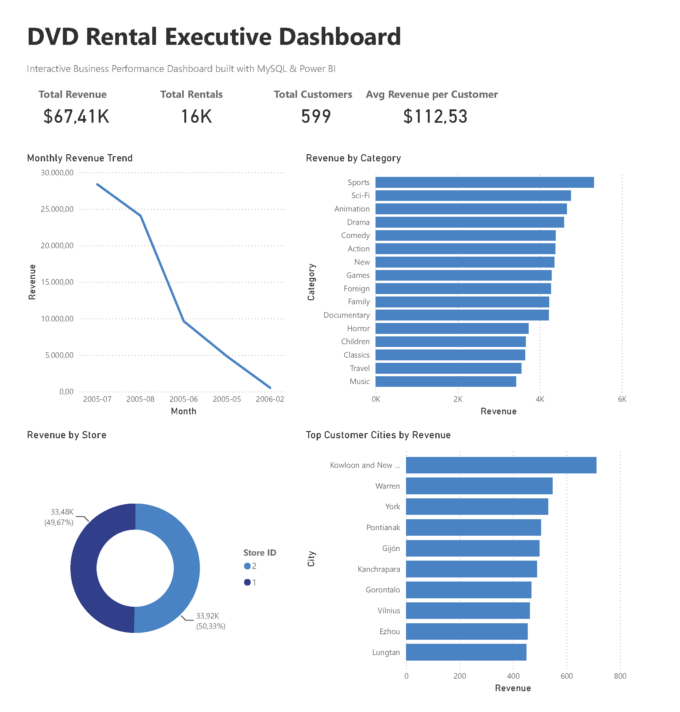
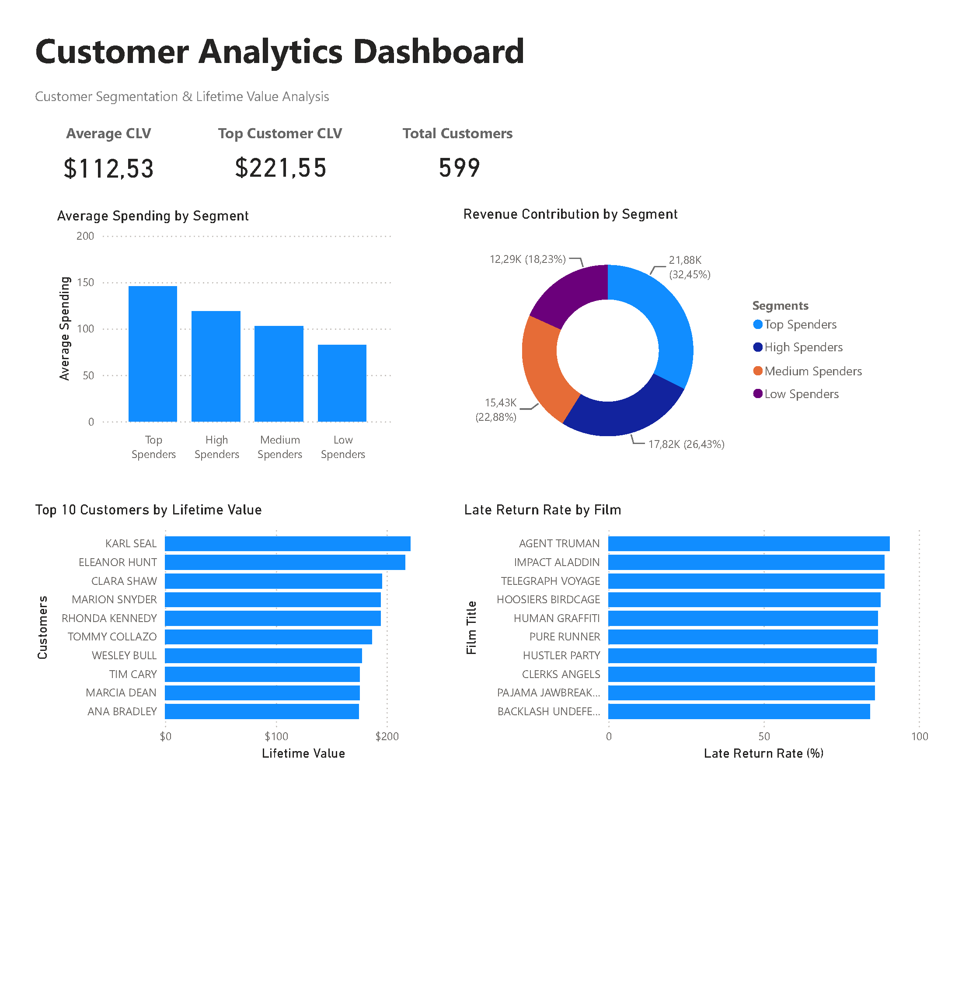

# DVD Rental Business Performance Analysis

A business-oriented SQL and Power BI portfolio project that analyzes the MySQL Sakila database through 24 business-focused analyses and a two-page interactive dashboard.


## Project Highlights

- 📊 **24 business-focused SQL analyses** across customer, revenue, store, and rental performance
- 📈 **Two-page interactive Power BI dashboard** for executive and customer analytics
- 🧩 Demonstrates advanced SQL techniques including **CTEs, Window Functions, CASE, RANK(), ROW_NUMBER(), NTILE(), LAG(), and Conditional Aggregation**
- 📁 Includes well-structured SQL scripts, reusable SQL views, CSV outputs, dashboard screenshots, and comprehensive project documentation

## Table of Contents

- [DVD Rental Business Performance Analysis](#dvd-rental-business-performance-analysis)
  - [Project Highlights](#project-highlights)
  - [Table of Contents](#table-of-contents)
  - [Project Overview](#project-overview)
  - [Power BI Dashboard](#power-bi-dashboard)
    - [Dashboard Pages](#dashboard-pages)
    - [Dashboard Features](#dashboard-features)
    - [Dashboard Preview](#dashboard-preview)
      - [Executive Dashboard](#executive-dashboard)
      - [Customer Analytics](#customer-analytics)
  - [Business Objectives](#business-objectives)
  - [Dataset](#dataset)
  - [Tools \& Technologies](#tools--technologies)
  - [Project Structure](#project-structure)
  - [SQL Skills Demonstrated](#sql-skills-demonstrated)
    - [SQL Techniques](#sql-techniques)
    - [Business Analytics](#business-analytics)
  - [Business Questions](#business-questions)
    - [Core Analysis](#core-analysis)
    - [Additional Analyses](#additional-analyses)
  - [Sample Results](#sample-results)
    - [01. Top Customers](#01-top-customers)
    - [02. Category Revenue](#02-category-revenue)
    - [03. Monthly Revenue](#03-monthly-revenue)
    - [04. Customer City Revenue](#04-customer-city-revenue)
    - [05. Store Performance](#05-store-performance)
    - [06. Popular Movies](#06-popular-movies)
    - [07. Customer Lifetime Value](#07-customer-lifetime-value)
    - [08. Customer Segmentation](#08-customer-segmentation)
    - [09. Rental Duration](#09-rental-duration)
    - [10. Repeat Customers](#10-repeat-customers)
  - [Key Insights](#key-insights)
  - [Future Improvements](#future-improvements)
  - [About](#about)

## Project Overview

This project analyzes the DVD Rental (Sakila) database to answer real-world business questions related to customer behavior, revenue, store performance, customer segmentation, and rental activity.

Using SQL, the project transforms raw transactional data into meaningful business insights through analytical queries, Common Table Expressions (CTEs), Window Functions, and aggregate calculations. Reusable SQL views then provide structured datasets for an interactive Power BI dashboard.

The goal is to demonstrate an end-to-end analytics workflow similar to those used by Business Intelligence and Data Analysts: defining business questions, querying and validating data, preparing reporting views, and presenting insights through dashboards.

## Power BI Dashboard

Nine reusable SQL views were imported into Power BI to build a two-page interactive dashboard focused on executive performance and customer analytics.

### Dashboard Pages

- Executive Dashboard
- Customer Analytics

### Dashboard Features

- KPI Cards
- Revenue Trend Analysis
- Category Performance
- Store Performance
- Customer Segmentation
- Customer Lifetime Value
- Late Return Analysis

### Dashboard Preview

#### Executive Dashboard



#### Customer Analytics



## Business Objectives

- Identify the highest-value customers based on revenue.
- Analyze revenue trends over time.
- Evaluate store and category performance.
- Measure customer lifetime value (CLV).
- Segment customers according to their spending behavior.
- Analyze rental duration and late return patterns.
- Identify repeat customers and evaluate customer loyalty.
- Support business decision-making through SQL analysis and dashboard reporting.

## Dataset

This project uses the **Sakila** sample database provided by MySQL, which simulates the operations of a DVD rental business.

The database includes information about customers, films, rentals, payments, stores, staff, inventory, categories, cities, and addresses, making it suitable for practicing business-oriented SQL analysis.

## Tools & Technologies

- SQL
- MySQL
- DBeaver
- Power BI
- Visual Studio Code
- Git
- GitHub

## Project Structure

```text
dvd-rental-business-performance-analysis/
├── queries/
│   ├── 01_top_customers.sql
│   ├── 02_category_revenue.sql
│   ├── 03_monthly_revenue.sql
│   ├── 04_customer_city_revenue.sql
│   ├── 05_store_performance.sql
│   ├── 06_popular_movies.sql
│   ├── 07_customer_lifetime_value.sql
│   ├── 08_customer_segmentation.sql
│   ├── 09_rental_duration.sql
│   └── 10_repeat_customers.sql
│
├── views/
│   ├── vw_category_revenue.sql
│   ├── vw_customer_city_revenue.sql
│   ├── vw_customer_kpis.sql
│   ├── vw_customer_lifetime_value.sql
│   ├── vw_customer_segmentation.sql
│   ├── vw_kpi_summary.sql
│   ├── vw_late_return_analysis.sql
│   ├── vw_monthly_revenue.sql
│   └── vw_store_performance.sql
│
├── results/
│   ├── 01_top_customer_revenue_share.csv
│   ├── 01_top_customers.csv
│   ├── 02_category_revenue.csv
│   ├── 02_category_revenue_share.csv
│   ├── 03_monthly_revenue.csv
│   ├── 03_monthly_revenue_above_average.csv
│   ├── 03_monthly_revenue_mom_change.csv
│   ├── 04_customer_city_revenue.csv
│   ├── 04_customer_city_revenue_share.csv
│   ├── 05_store_performance.csv
│   ├── 05_store_revenue_share.csv
│   ├── 06_popular_movies.csv
│   ├── 06_top10_movie_revenue_share.csv
│   ├── 07_above_average_clv.csv
│   ├── 07_customer_lifetime_value.csv
│   ├── 08_customer_segment_distribution.csv
│   ├── 08_customer_segment_performance.csv
│   ├── 08_customer_segmentation.csv
│   ├── 09_average_delay.csv
│   ├── 09_late_return_rate.csv
│   ├── 09_rental_duration.csv
│   ├── 10_repeat_customer_distribution.csv
│   ├── 10_repeat_customer_rate.csv
│   └── 10_repeat_customers.csv
│
├── screenshots/
│   ├── customer_analytics.png
│   └── executive_dashboard.png
│
├── LICENSE
└── README.md
```

## SQL Skills Demonstrated

### SQL Techniques
- Complex JOIN operations
- Common Table Expressions (CTEs)
- Aggregate Functions
- Window Functions
  - RANK()
  - ROW_NUMBER()
  - NTILE()
  - LAG()
  - SUM() OVER()
  - AVG() OVER()
- CASE Expressions
- Conditional Aggregation
- Date Functions

### Business Analytics
- Customer Segmentation
- Revenue Analysis
- Business KPI Calculations

## Business Questions

### Core Analysis

| File | Business Question |
|------|-------------------|
| 01 | Who are the top customers by total revenue? |
| 02 | Which film categories generate the highest revenue? |
| 03 | How does monthly revenue trend over time? |
| 04 | Which customer cities generate the highest revenue? |
| 05 | Which store generates the highest revenue? |
| 06 | Which are the top 10 most frequently rented movies? |
| 07 | Who are the top customers by lifetime value (CLV)? |
| 08 | How are customers distributed across spending segments? |
| 09 | What is the average rental duration for each film? |
| 10 | Which repeat customers have the highest number of rentals? |

### Additional Analyses

- Calculate each top customer's contribution to total revenue.
- Measure each category's share of total revenue.
- Compare monthly revenue with the previous month using `LAG()`.
- Identify months that performed above the average monthly revenue.
- Calculate each customer city's contribution to total revenue.
- Measure each store's contribution to total revenue.
- Calculate the percentage of total revenue generated by the top 10 rented movies.
- Identify customers whose lifetime value is above average.
- Analyze customer spending using quartile-based segmentation with `NTILE()`.
- Compare spending segments by average spending and revenue contribution.
- Measure late return rates against allowed rental duration.
- Calculate the average delay beyond the allowed rental duration.
- Calculate the repeat customer rate.
- Analyze repeat customers by rental frequency.

## Sample Results

### 01. Top Customers

- Main Analysis: [View result](results/01_top_customers.csv)
- Revenue Contribution of Top Customers: [View result](results/01_top_customer_revenue_share.csv)

---

### 02. Category Revenue

- Main Analysis: [View result](results/02_category_revenue.csv)
- Revenue Share by Category: [View result](results/02_category_revenue_share.csv)

---

### 03. Monthly Revenue

- Main Analysis: [View result](results/03_monthly_revenue.csv)
- Month-over-Month Revenue Change: [View result](results/03_monthly_revenue_mom_change.csv)
- Above-Average Revenue Months: [View result](results/03_monthly_revenue_above_average.csv)

---

### 04. Customer City Revenue

- Main Analysis: [View result](results/04_customer_city_revenue.csv)
- Revenue Share by Customer City: [View result](results/04_customer_city_revenue_share.csv)

---

### 05. Store Performance

- Main Analysis: [View result](results/05_store_performance.csv)
- Revenue Share by Store: [View result](results/05_store_revenue_share.csv)

---

### 06. Popular Movies

- Main Analysis: [View result](results/06_popular_movies.csv)
- Revenue Contribution of Top 10 Rented Movies: [View result](results/06_top10_movie_revenue_share.csv)

---

### 07. Customer Lifetime Value

- Main Analysis: [View result](results/07_customer_lifetime_value.csv)
- Customers Above Average CLV: [View result](results/07_above_average_clv.csv)

---

### 08. Customer Segmentation

- Customer Spending Segmentation: [View result](results/08_customer_segmentation.csv)
- Customer Distribution by Spending Segment: [View result](results/08_customer_segment_distribution.csv)
- Spending Segment Performance: [View result](results/08_customer_segment_performance.csv)

---

### 09. Rental Duration

- Main Analysis: [View result](results/09_rental_duration.csv)
- Late Return Rate by Film: [View result](results/09_late_return_rate.csv)
- Average Delay Beyond Allowed Rental Duration: [View result](results/09_average_delay.csv)

---

### 10. Repeat Customers

- Main Analysis: [View result](results/10_repeat_customers.csv)
- Repeat Customer Rate: [View result](results/10_repeat_customer_rate.csv)
- Repeat Customer Distribution by Rental Frequency: [View result](results/10_repeat_customer_distribution.csv)

## Key Insights

- 💰 The highest-value customer generated **221.55** in total revenue.
- 🏆 The **Sports** category generated the highest total revenue among all film categories.
- 📈 Monthly revenue peaked in **July 2005**, reaching **28,368.91**.
- 🌍 Customers from **Kowloon and New Kowloon** generated the highest city-level revenue.
- 🏪 **Store 2** generated the highest total revenue.
- 🎬 **BUCKET BROTHERHOOD** was the most frequently rented film with **34 rentals**.
- 👑 The **Top Spenders** customer segment contributed **32.45%** of the total revenue.
- ⏰ Some films experienced a **late return rate exceeding 90%**, highlighting significant differences in customer return behavior.
- 🔁 In the Sakila sample dataset, all customers rented more than once, resulting in a 100% repeat customer rate.

## Future Improvements

- Create reusable DAX measures for key business KPIs.
- Add a dedicated Date table for advanced time intelligence and filtering.
- Perform RFM (Recency, Frequency, Monetary) customer segmentation.
- Extend the project using Python (Pandas) for advanced analytics and visualization.

## About

This project was created as part of my data analytics portfolio to demonstrate practical SQL and Power BI skills by solving real-world business problems using the MySQL Sakila sample database.

I focused on the complete analytics workflow: writing SQL queries, creating reusable reporting views, validating exported results, and presenting the findings through interactive dashboards and clear project documentation.
